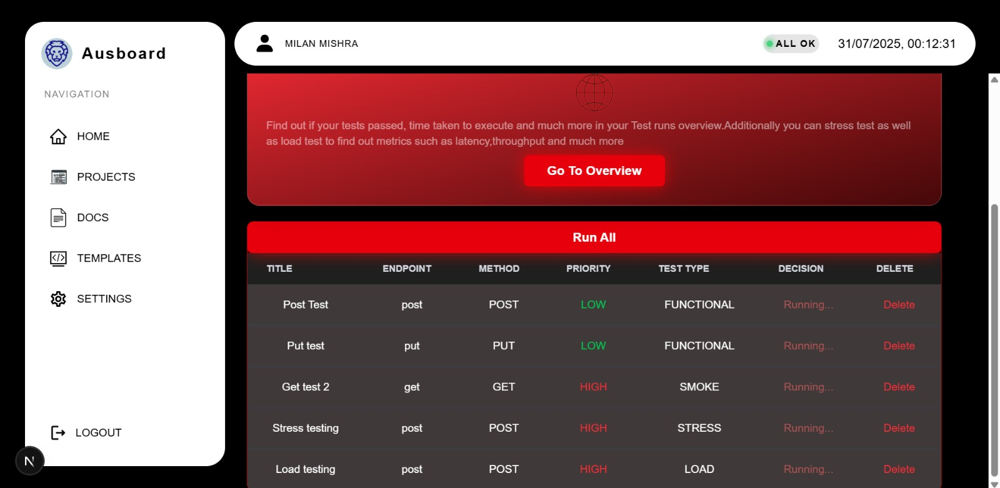
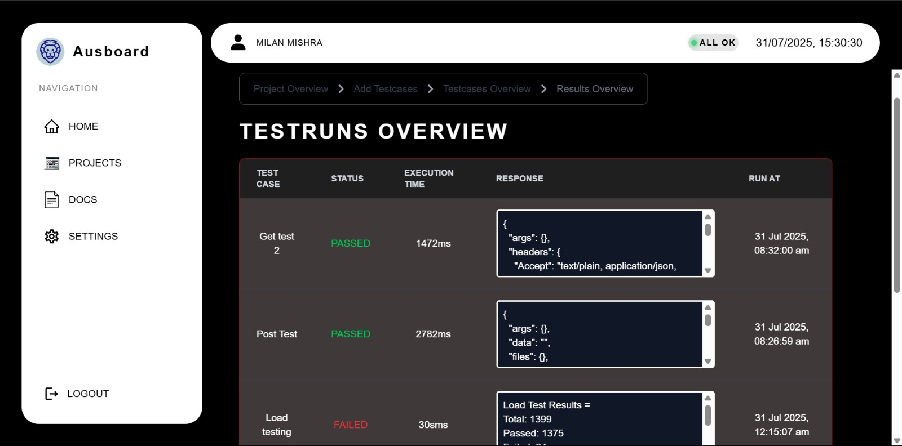

````markdown
# 🚀 Ausboard – API Testing Frontend

Ausboard is a powerful and intuitive API testing platform that supports various types of testing such as **functional**, **smoke**, **fuzz**, **stress**, and **load testing**. This is the **frontend** repository built using **Next.js** and **TypeScript**.

---

## ✨ Features

- 🔧 Supports **Functional**, **Smoke**, **Fuzz**, **Stress**, and **Load Testing**
- 🧪 Run **multiple test cases simultaneously**
- 📊 Displays **latency**, **throughput**, **execution time**, and other performance metrics
- 📁 Organized interface for managing test cases and results
- ⚡ Real-time updates and responsive design

---

## 🖥️ Tech Stack

- **Framework:** [Next.js](https://nextjs.org/)
- **Language:** TypeScript
- **UI:** Tailwind CSS (if used), React Components
- **State Management:** React Hooks, Context API (if applicable)
- **HTTP Client:** fetch / axios (if used)

---

## 📦 Installation

### 1. Clone the Repository

```bash
git clone https://github.com/MilanMishra19/ausboardfk.git
cd ausboardfk
````

### 2. Install Dependencies

```bash
npm install
```

### 3. Start the Development Server

```bash
npm start
```

> The app will run at `http://localhost:3000`

---

## 📈 The App Supports:

| Type       | Description                                                |
| ---------- | ---------------------------------------------------------- |
| Functional | Validates if APIs work as expected under normal conditions |
| Smoke      | Basic tests to check if critical endpoints are working     |
| Fuzz       | Sends random or invalid data to test robustness            |
| Stress     | Tests how the API performs under high load or usage        |
| Load       | Simulates concurrent users to evaluate performance         |

---

## 📸 Screenshots


| Test Dashboard View                       | Result Metrics View                   |
| ----------------------------------------- | ------------------------------------- |
|  |  |


---

## 🔗 Backend Repository

👉 **Ausboard Backend:** [https://github.com/MilanMishra19/ausboardbk](https://github.com/MilanMishra19/ausboardbk)

---


## 🙌 Contributions

Contributions are welcome! Please open issues or pull requests for improvements or bug fixes.

```

---


